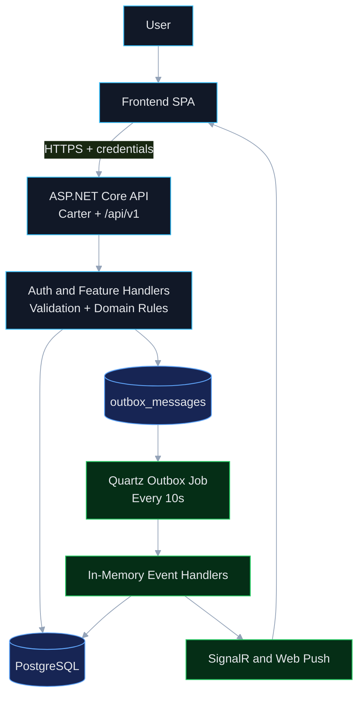
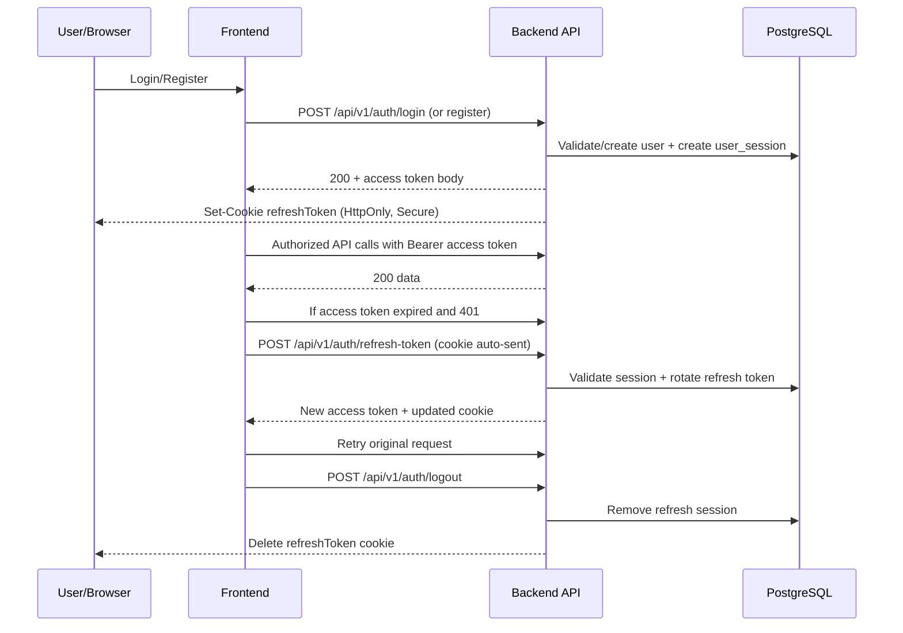
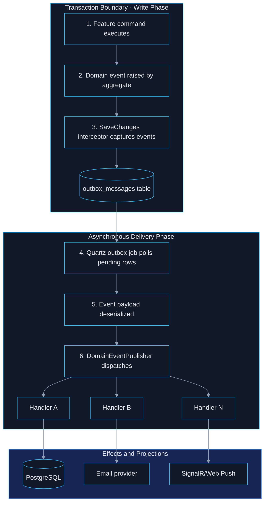

# Veterinary Auth Template

Production-ready authentication and backend template for a multi-tenant veterinary SaaS.

This README gives a full high-level backend architecture, auth flow, outbox/events/jobs dispatch model, and practical setup instructions without being overly long.

## What This Template Gives You

- JWT access-token auth with secure refresh-token cookies
- Argon2 password hashing
- Vertical-slice feature architecture (CQRS style handlers + endpoints)
- PostgreSQL + EF Core migrations
- Outbox pattern for durable domain-event delivery
- Quartz background jobs for event dispatch and recurring business tasks
- In-memory pub/sub dispatch to domain event handlers (no external broker required)
- SignalR notifications + Web Push integration
- Docker Compose local development path

## Why Choose This Template

- **Secure defaults for auth**: short-lived access token + rotating refresh token
- **Fast feature development**: each use case lives in one slice (command/query, validator, handler, endpoint)
- **Operational safety**: events are written to outbox in the same transaction as domain changes
- **Simple event runtime**: in-memory handler fan-out keeps infra lightweight for early-stage products
- **Scales in steps**: can evolve from in-memory pub/sub to external broker later, without changing domain model

## High-Level System Design



## Backend Architecture (How It Works)

### 1. API composition

- Entry point configures services in `Program.cs`
- All Carter endpoints are grouped under `/api/v1`
- Middleware order includes CORS, exception handlers, authentication, authorization
- On startup, migrations are applied via `app.ApplyMigrations()`

### 2. Feature slices

Each operation is implemented as a vertical slice in `Features/*` with:

- Command/Query DTO
- Validator (FluentValidation)
- Handler (`ICommandHandler` or `IQueryHandler`)
- Endpoint route mapping

### 3. Domain + persistence

- Domain entities live in `Domain/*`
- EF Core mappings/configurations live in `Infrastructure/Persistence/Configurations/*`
- PostgreSQL used through Npgsql provider

### 4. Auth and tenant context

- Access token: signed JWT (HMAC-SHA256)
- Refresh token: opaque random token in `refreshToken` cookie
- Current user resolved from `ClaimTypes.NameIdentifier`
- Tenant isolation uses tenant-aware model/interceptors

## Authentication Model

### Token strategy

- **Access token**: short-lived JWT (minutes, from env)
- **Refresh token**: 7-day secure cookie
  - `HttpOnly = true`
  - `Secure = true`
  - `SameSite = None`

### Auth endpoints (under `/api/v1`)

- `POST /auth/register`
- `POST /auth/login`
- `POST /auth/refresh-token`
- `POST /auth/logout`
- `GET /auth/me`
- `POST /auth/forget-password`
- `PUT /auth/reset-passowrd` (current route spelling in implementation)

### Auth flow diagram



## Outbox, Events, Jobs, and In-Memory Pub/Sub

### Why this exists

Without an outbox, domain state could commit while event delivery fails. This template avoids that by writing events to an outbox table in the same DB transaction.

### Outbox pipeline

1. Domain entity raises event (`RaiseDomainEvent`)
2. EF `SaveChanges` interceptor collects events and inserts `outbox_messages`
3. Quartz `ProcessOutboxMessagesJob` polls unprocessed rows every 10 seconds
4. Job deserializes events and publishes to in-memory event publisher
5. Publisher resolves all `IDomainEventHandler<T>` handlers from DI and executes them
6. Outbox row marked processed

### Dispatch model

- This is **in-memory pub/sub** inside the API process
- Fan-out is handler-based (DI-resolved subscribers)
- No Kafka/RabbitMQ dependency is required for current setup

### Event flow diagram



## How Frontend Uses This Backend

The frontend auth client uses:

- Axios instance with `withCredentials: true` (refresh cookie included automatically)
- In-memory access token store (`tokenManager`)
- Request interceptor adds `Authorization: Bearer <accessToken>`
- Response interceptor catches `401`, calls refresh endpoint, retries original request

This gives secure refresh behavior without storing refresh token in local storage.

## Quick Start

### Prerequisites

- .NET 10 SDK
- Docker Desktop
- PostgreSQL client tools (optional)
- `dotnet-ef` tool for manual migration commands

### 1) Create environment files

Source template:

- `backend/Veterinary/src/VeterinaryApi/.env.example`

Create runtime env files:

- `backend/Veterinary/src/VeterinaryApi/.env` (used by app `Env.Load()`)
- `backend/Veterinary/.env` (used by Docker Compose `env_file`)

Keep both files synchronized.

### 2) Configure environment variables

Use this as a complete starter template:

```env
# Database (currently read by runtime using DefaultConnectionLocal)
DefaultConnectionLocal="Host=localhost;Port=5432;Database=veterinary_db;Username=veterinary_user;Password=2501;Pooling=true;Minimum Pool Size=5;Maximum Pool Size=100;"

# JWT
JWT_SECRET_KEY="replace-with-32+char-secret"
JWT_ISSUER="https://localhost:7256"
JWT_AUDIENCE="http://localhost:5173"
JWT_ACCESS_TOKEN_LIFETIME_MINUTES=15

# Email / SMTP settings (currently bound at startup)
EMAIL_CONFIGURATIONS_EMAIL="noreply@example.com"
EMAIL_CONFIGURATIONS_PASSWORD="smtp-or-app-password"
EMAIL_CONFIGURATIONS_HOST="smtp.gmail.com"
EMAIL_CONFIGURATIONS_PORT=587

# Resend
RESEND_APITOKEN="replace-resend-token"

# Web Push (optional in local)
WEBPUSH_VAPID_PUBLIC_KEY="replace-vapid-public"
WEBPUSH_VAPID_PRIVATE_KEY="replace-vapid-private"
WEBPUSH_SUBJECT="mailto:admin@example.com"

# Payments (required by current startup wiring)
CHARGILY_SECRET_KEY="replace-chargily-secret"
CHARGILY_IS_LIVE_MODE=false
CHARGILY_WEBHOOK_URL="https://your-api-domain/api/v1/subscriptions/webhook"
CHARGILY_SUCCESS_URL="http://localhost:5173/subscriptions/success"
CHARGILY_FAILURE_URL="http://localhost:5173/subscriptions/failure"
```

### 3) Run with Docker Compose (recommended)

```bash
cd backend/Veterinary
docker compose up --build
```

Services:

- API: `https://localhost:7256` and `http://localhost:8080`
- PostgreSQL: `localhost:5432`
- pgAdmin: `http://localhost:5050`

### 4) Run API directly (without full compose)

Start PostgreSQL first, then:

```bash
cd backend/Veterinary/src/VeterinaryApi
dotnet run
```

## PostgreSQL Migrations (EF Core)

Migrations are auto-applied on startup (`Database.Migrate()`), but manual commands are still useful.

### Install EF tool (if needed)

```bash
dotnet tool install --global dotnet-ef
```

### Add a new migration

```bash
dotnet ef migrations add <MigrationName> --project backend/Veterinary/src/VeterinaryApi --startup-project backend/Veterinary/src/VeterinaryApi
```

### Apply migrations manually

```bash
dotnet ef database update --project backend/Veterinary/src/VeterinaryApi --startup-project backend/Veterinary/src/VeterinaryApi
```

### Verify migration list

```bash
dotnet ef migrations list --project backend/Veterinary/src/VeterinaryApi --startup-project backend/Veterinary/src/VeterinaryApi
```

## Current Implementation Notes (Documented As-Is)

- Reset password route is currently `PUT /auth/reset-passowrd` (spelling preserved).
- Runtime DB connection in DI currently reads `DefaultConnectionLocal` env variable.
- Outbox processor job polls every 10 seconds and processes pending rows in batches.
- Event delivery is in-memory handler fan-out (DI pub/sub), not an external message broker.
- Daily subscription maintenance jobs are scheduled via Quartz at 00:00 UTC.

## Folder Reference

- Backend API: `backend/Veterinary/src/VeterinaryApi`
- Auth slices: `backend/Veterinary/src/VeterinaryApi/Features/Users` and `backend/Veterinary/src/VeterinaryApi/Features/Auth`
- Outbox: `backend/Veterinary/src/VeterinaryApi/Infrastructure/OutboxMessages`
- Event dispatch: `backend/Veterinary/src/VeterinaryApi/Infrastructure/CQRS`
- Frontend auth integration: `frontend/src/lib/api`

---

If you want, the next step is adding a short API example section (request/response samples for login, refresh, logout, reset) to make QA and frontend onboarding even faster.
