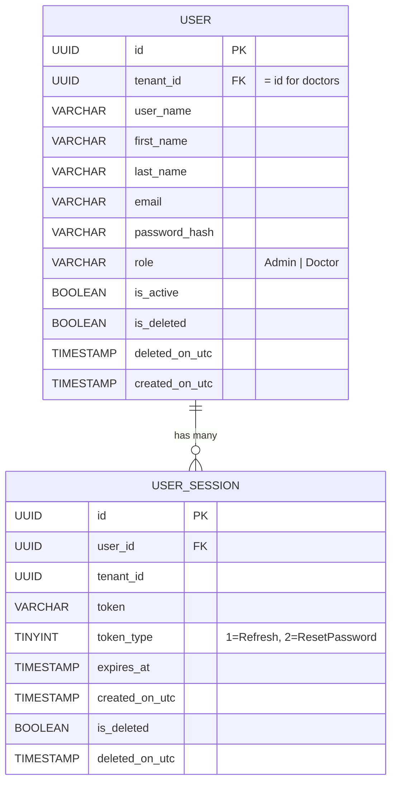

# Authentication & Authorization — System Documentation

> **Applies to:** VeterinaryApi backend (ASP.NET Core + EF Core)
> **Architecture style:** Vertical Slice (CQRS, Domain Events, Outbox Pattern)

---

## Table of Contents

1. [High-Level Design](#1-high-level-design)
2. [What We Need (Building Blocks)](#2-what-we-need-building-blocks)
3. [Entity Relationship Diagram](#3-entity-relationship-diagram)
4. [Entities — Deep Dive](#4-entities--deep-dive)
   - [User](#41-user)
   - [UserSession](#42-usersession)
   - [UserRoles (enum)](#43-userroles-enum)
   - [UserSessionTokenType (enum)](#44-usersessiontokentype-enum)
5. [Low-Level Design — Flow by Flow](#5-low-level-design--flow-by-flow)
   - [Register](#51-register)
   - [Login](#52-login)
   - [Refresh Token (Token Rotation)](#53-refresh-token-token-rotation)
   - [Logout](#54-logout)
   - [Get Current User (Me)](#55-get-current-user-me)
   - [Forget Password](#56-forget-password)
   - [Reset Password](#57-reset-password)
   - [Change Password](#58-change-password)
   - [Change Email](#59-change-email)
6. [API Endpoint Summary](#6-api-endpoint-summary)
7. [Security Decisions & Notes](#7-security-decisions--notes)
8. [Error Codes Reference](#8-error-codes-reference)

---

## 1. High-Level Design

```
┌───────────────────────────────────────────────────────────────────────────┐
│                              CLIENT (SPA)                                │
│  Stores: JWT access token (memory)                                       │
│  Browser auto-sends: refreshToken cookie (HttpOnly, Secure, SameSite)    │
└──────────────────────────┬────────────────────────────────────────────────┘
                           │  HTTPS
                           ▼
┌───────────────────────────────────────────────────────────────────────────┐
│                          ASP.NET Core API                                │
│                                                                          │
│  ┌──────────────┐   ┌──────────────┐   ┌────────────────────────────┐   │
│  │ JWT Bearer   │──▶│ CurrentUser  │──▶│ Tenant Interceptor         │   │
│  │ Middleware   │   │ Service      │   │ (stamps TenantId on       │   │
│  │ (validates   │   │ (reads       │   │  every new entity)         │   │
│  │  access      │   │  ClaimTypes. │   └────────────────────────────┘   │
│  │  token)      │   │  NameId)     │                                     │
│  └──────────────┘   └──────────────┘                                     │
│                                                                          │
│  ┌──────────────────────────────────────────────────────────────────┐    │
│  │                    Auth Feature Slices                            │    │
│  │  POST /auth/register         – create account + issue tokens     │    │
│  │  POST /auth/login            – verify creds  + issue tokens      │    │
│  │  POST /auth/refresh-token    – rotate tokens                     │    │
│  │  POST /auth/logout           – revoke session + clear cookie     │    │
│  │  GET  /auth/me               – return current user profile       │    │
│  │  POST /auth/forget-password  – email reset link                  │    │
│  │  PUT  /auth/reset-passowrd   – consume token + set new password  │    │
│  │  POST /change-password       – authenticated password change     │    │
│  │  PATCH /change-email         – authenticated email change        │    │
│  └──────────────────────────────────────────────────────────────────┘    │
│                                                                          │
│  ┌──────────────────────────────────────────────────────────────────┐    │
│  │                    Infrastructure Services                        │    │
│  │  IJwtProvider  ──▶  JwtProvider  (HMAC-SHA256 JWT + random       │    │
│  │                                   refresh token)                  │    │
│  │  IPasswordHasher ──▶ Argon2PasswordHasher                        │    │
│  │  IEmailService   ──▶ EmailService (SMTP)                         │    │
│  └──────────────────────────────────────────────────────────────────┘    │
│                                                                          │
│  ┌──────────────────────────────────────────────────────────────────┐    │
│  │               PostgreSQL (via EF Core)                            │    │
│  │  Tables: users, user_sessions                                     │    │
│  │  Outbox: outbox_messages (domain event publishing)                │    │
│  └──────────────────────────────────────────────────────────────────┘    │
└───────────────────────────────────────────────────────────────────────────┘
```

### How it works at a glance

| Concept | Implementation |
|---|---|
| **Access token** | Short-lived JWT (configurable, typically 15–60 min). Signed with HMAC-SHA256. Contains `NameIdentifier`, `Name`, `sub`, `jti`, `iat` claims. Sent by the client in `Authorization: Bearer <token>`. |
| **Refresh token** | 32 cryptographically-random bytes (Base64). Stored server-side in the `user_sessions` table. Delivered to the client as an **HttpOnly, Secure, SameSite=None** cookie named `refreshToken` with a **7-day** expiry. |
| **Password storage** | **Argon2** (OWASP-recommended). The hash is self-contained (includes salt + params). |
| **Token rotation** | On every `/auth/refresh-token` call the old token is overwritten with a new one. This prevents replay attacks — a stolen token can only be used once. |
| **Multi-tenancy** | Each `User` is their own tenant (`TenantId == User.Id`). All owned data (clinics, animals, clients, etc.) is automatically stamped with the user's tenant ID via `TenantInterceptor`. |
| **Domain events** | The forget-password flow raises a `UserForgetPasswordDomainEvent` which is persisted to the Outbox and processed asynchronously to send the reset email. |

---

## 2. What We Need (Building Blocks)

To build a production-grade auth system like this one, you need:

| Category | Component | Purpose |
|---|---|---|
| **Domain** | `User` entity | Holds identity, credentials (hashed), role, profile |
| **Domain** | `UserSession` entity | Persists refresh tokens and password-reset tokens |
| **Domain** | `UserRoles` enum | Role-based access (Admin, Doctor) |
| **Domain** | `UserSessionTokenType` enum | Discriminates Refresh vs ResetPassword sessions |
| **Domain** | `UserErrors` | Centralized typed error definitions |
| **Domain** | `UserForgetPasswordDomainEvent` | Event raised when a password reset is requested |
| **Infrastructure** | `IJwtProvider` / `JwtProvider` | Issues JWT access tokens & opaque refresh tokens |
| **Infrastructure** | `JwtOptions` | Config object (Issuer, Audience, SigningKey, LifeTime) |
| **Infrastructure** | `IPasswordHasher` / `Argon2PasswordHasher` | Hashes and verifies passwords with Argon2 |
| **Infrastructure** | `ICurrentTenant` / `CurrentUserService` | Reads authenticated user ID from the JWT claims |
| **Infrastructure** | `IEmailService` / `EmailService` | Sends password-reset emails via SMTP |
| **Infrastructure** | `TenantInterceptor` | Auto-stamps `TenantId` on new entities |
| **Persistence** | `UserConfiguration` | EF Core fluent config for `users` table |
| **Persistence** | `UserSessionConfiguration` | EF Core fluent config for `user_sessions` table |
| **Features** | Vertical slices | One file per use-case: Register, Login, Logout, RefreshToken, ForgetPassword, ResetPassword, ChangePassword, ChangeEmail, Me |

---

## 3. Entity Relationship Diagram

```
┌──────────────────────────────────────────────────────────────┐
│                          users                                │
├──────────────────────────────────────────────────────────────┤
│  id              : UUID  (PK, generated at creation)          │
│  tenant_id       : UUID  (FK → self, = id for doctors)        │
│  user_name       : VARCHAR(100)  NOT NULL                     │
│  first_name      : VARCHAR(100)  NOT NULL                     │
│  last_name       : VARCHAR(100)  NOT NULL                     │
│  email           : VARCHAR(256)  NOT NULL                     │
│  password_hash   : VARCHAR(500)  NOT NULL (Argon2)            │
│  role            : VARCHAR(50)   NOT NULL ('Admin'|'Doctor')  │
│  is_active       : BOOLEAN       DEFAULT true                 │
│  is_deleted      : BOOLEAN       (soft-delete flag)           │
│  deleted_on_utc  : TIMESTAMP     (nullable)                   │
│  created_on_utc  : TIMESTAMP                                  │
├──────────────────────────────────────────────────────────────┤
│  INDEXES                                                      │
│   ix_users_tenant_id            (tenant_id)                   │
│   ix_users_tenant_id_email      (tenant_id, email)   UNIQUE   │
│   ix_users_tenant_id_user_name  (tenant_id, user_name) UNIQUE │
│  QUERY FILTER: WHERE is_deleted = false                       │
└──────────────┬───────────────────────────────────────────────┘
               │  1 ──── * (one user has many sessions)
               ▼
┌──────────────────────────────────────────────────────────────┐
│                      user_sessions                            │
├──────────────────────────────────────────────────────────────┤
│  id              : UUID       (PK, generated at creation)     │
│  user_id         : UUID       (FK → users.id) NOT NULL        │
│  tenant_id       : UUID       NOT NULL                        │
│  token           : VARCHAR(1000) NOT NULL                     │
│  token_type      : TINYINT    NOT NULL (1=Refresh, 2=Reset)   │
│  expires_at      : TIMESTAMP  (nullable)                      │
│  created_on_utc  : TIMESTAMP                                  │
│  is_deleted      : BOOLEAN    (inherited from Entity)         │
│  deleted_on_utc  : TIMESTAMP  (nullable)                      │
├──────────────────────────────────────────────────────────────┤
│  INDEXES                                                      │
│   ix_user_sessions_user_id    (user_id)                       │
│   ix_user_sessions_token      (token)                         │
│   ix_user_sessions_tenant_id  (tenant_id)                     │
│  ON DELETE: CASCADE (deleting user removes all sessions)      │
└──────────────────────────────────────────────────────────────┘
```

### Mermaid Diagram



---

## 4. Entities — Deep Dive

### 4.1 User

**File:** `Domain/Users/User.cs`
**Table:** `users`

The `User` entity is the **aggregate root** for authentication. It inherits from the `Entity` base class which provides:
- `Id` (Guid, auto-generated)
- `CreatedOnUtc`
- `IsDeleted` / `DeletedOnUtc` (soft-delete)
- `TenantId` (multi-tenant isolation)
- Domain event collection (Outbox pattern)

#### Properties

| Property | Type | Description |
|---|---|---|
| `UserName` | `string` | Unique display name within the tenant |
| `FirstName` | `string` | User's first name |
| `LastName` | `string` | User's last name |
| `FullName` | `string` (computed) | `"{FirstName} {LastName}"` |
| `Email` | `string` | Unique email used for login + notifications |
| `PasswordHash` | `string` | Argon2-hashed password (never exposed in API responses) |
| `Role` | `UserRoles` | `Admin` or `Doctor` |
| `IsActive` | `bool` | Whether the account is enabled |
| `Sessions` | `IReadOnlyCollection<UserSession>` | Navigation to refresh/reset tokens |

#### Factory Methods

| Method | Description |
|---|---|
| `User.Create(firstName, lastName, email, passwordHash, role)` | Admin-level user creation. Sets `TenantId = Id`. |
| `User.Register(userName, firstName, lastName, email, passwordHash)` | Self-registration. Defaults role to `Doctor`. |

#### Behavior Methods

| Method | Description |
|---|---|
| `UpdatePassword(password, newPasswordHash)` | Validates min length (6 chars), then updates hash. Throws `DomainException` on invalid length. |
| `UpdateProfile(userName, firstName, lastName)` | Updates profile fields. |
| `UpdateEmail(email)` | Updates email address. |
| `ForgetPassword(token, clientUri)` | Raises a `UserForgetPasswordDomainEvent` (processed via Outbox → sends email). |

---

### 4.2 UserSession

**File:** `Domain/Users/UserSession.cs`
**Table:** `user_sessions`

The `UserSession` entity stores **both** refresh tokens and password-reset tokens. The `TokenType` discriminator tells them apart.

| Property | Type | Description |
|---|---|---|
| `UserId` | `Guid` | FK to the owning `User` |
| `Token` | `string` | The opaque token string (Base64 for refresh, JWT for reset) |
| `TokenType` | `UserSessionTokenType` | `Refresh` (1) or `ResetPassword` (2) |
| `ExpiresAt` | `DateTime?` | UTC expiration timestamp |
| `User` | `User` | Navigation property |

**Lifecycle:**
- **Refresh tokens** — created on login/register, updated (rotated) on refresh, deleted on logout.
- **Reset tokens** — created on forget-password, validated (not deleted) on reset-password. Should be cleaned up by a background job.

---

### 4.3 UserRoles (enum)

**File:** `Domain/Users/UserRoles.cs`

```csharp
public enum UserRoles : byte
{
    Admin  = 1,   // Full administrative access
    Doctor = 2,   // Veterinary professional (default on self-registration)
}
```

Stored as a `string` in the database (EF conversion). Embedded in the JWT so authorization policies can be enforced per-endpoint without a DB round-trip.

---

### 4.4 UserSessionTokenType (enum)

**File:** `Domain/Users/UserSession.cs`

```csharp
public enum UserSessionTokenType : byte
{
    Refresh       = 1,   // Used to obtain new JWT access tokens
    ResetPassword = 2,   // One-time token sent via email for password reset
}
```

Stored as a `byte` in the database.

---

## 5. Low-Level Design — Flow by Flow

### 5.1 Register

**Endpoint:** `POST /auth/register`
**File:** `Features/Users/Register.cs`
**Authentication required:** No

#### Request Body

```json
{
  "email": "vet@example.com",
  "password": "SecurePass123",
  "userName": "dr_smith",
  "firstName": "John",
  "lastName": "Smith"
}
```

#### Flow

```
Client                          API                               Database
  │                              │                                    │
  │  POST /auth/register         │                                    │
  │─────────────────────────────▶│                                    │
  │                              │  1. Hash password (Argon2)         │
  │                              │  2. Check email uniqueness ───────▶│
  │                              │               ◄───── true/false ───│
  │                              │  3. User.Register() factory        │
  │                              │  4. Generate JWT access token      │
  │                              │  5. Generate refresh token (random)│
  │                              │  6. Create UserSession             │
  │                              │     (Refresh, 7-day expiry)        │
  │                              │  7. SaveChangesAsync ─────────────▶│
  │                              │               ◄──── persisted ─────│
  │                              │  8. Set refreshToken cookie        │
  │  ◄───────────────────────────│     (HttpOnly, Secure, SameSite)   │
  │  200 OK { token: "eyJ..." }  │                                    │
  │  + Set-Cookie: refreshToken  │                                    │
```

#### Error Responses

| Condition | Error Code | HTTP Status |
|---|---|---|
| Email already registered | `User.EmailAlreadyInUse` | 409 Conflict |

---

### 5.2 Login

**Endpoint:** `POST /auth/login`
**File:** `Features/Users/Login.cs`
**Authentication required:** No

#### Request Body

```json
{
  "email": "vet@example.com",
  "password": "SecurePass123"
}
```

#### Flow

```
Client                          API                               Database
  │                              │                                    │
  │  POST /auth/login            │                                    │
  │─────────────────────────────▶│                                    │
  │                              │  1. Find user by email ───────────▶│
  │                              │               ◄──── user/null ─────│
  │                              │  2. Verify password (Argon2)       │
  │                              │  3. Generate JWT access token      │
  │                              │  4. Generate refresh token (random)│
  │                              │  5. Create UserSession             │
  │                              │     (Refresh, 7-day expiry)        │
  │                              │  6. SaveChangesAsync ─────────────▶│
  │                              │               ◄──── persisted ─────│
  │                              │  7. Set refreshToken cookie        │
  │  ◄───────────────────────────│                                    │
  │  200 OK { token: "eyJ..." }  │                                    │
  │  + Set-Cookie: refreshToken  │                                    │
```

#### Error Responses

| Condition | Error Code | HTTP Status |
|---|---|---|
| Email not found | `User.NotFound` | 404 Not Found |
| Wrong password | `User.InvalidCredentials` | 401 Unauthorized |

---

### 5.3 Refresh Token (Token Rotation)

**Endpoint:** `POST /auth/refresh-token`
**File:** `Features/Users/RefreshToken.cs`
**Authentication required:** No (uses cookie)

The client does **not** send a request body. The refresh token is read from the `refreshToken` HTTP-only cookie automatically.

#### Flow

```
Client                          API                               Database
  │                              │                                    │
  │  POST /auth/refresh-token    │                                    │
  │  Cookie: refreshToken=abc123 │                                    │
  │─────────────────────────────▶│                                    │
  │                              │  1. Read token from cookie         │
  │                              │  2. Find UserSession by token ────▶│
  │                              │     (Include User navigation)      │
  │                              │               ◄─── session/null ───│
  │                              │  3. Check ExpiresAt > now          │
  │                              │  4. Generate new JWT access token  │
  │                              │  5. Generate new refresh token     │
  │                              │  6. Overwrite session.Token ──────▶│
  │                              │     (rotation — old token invalid) │
  │                              │               ◄──── updated ───────│
  │                              │  7. Set new refreshToken cookie    │
  │  ◄───────────────────────────│                                    │
  │  200 OK { token: "eyJ..." }  │                                    │
  │  + Set-Cookie: refreshToken  │                                    │
```

**Key security property:** After rotation, the old refresh token is no longer valid. If an attacker stole the old token, their attempt to use it will fail because the token in the DB has been overwritten.

#### Error Responses

| Condition | Error Code | HTTP Status |
|---|---|---|
| Token not found in DB | `User.InvalidCredentials` | 401 Unauthorized |
| Token expired | `User.ExpiredRefreshToken` | 409 Conflict |

---

### 5.4 Logout

**Endpoint:** `POST /auth/logout`
**File:** `Features/Users/Logout.cs`
**Authentication required:** No (uses cookie)

#### Flow

```
Client                          API                               Database
  │                              │                                    │
  │  POST /auth/logout           │                                    │
  │  Cookie: refreshToken=abc123 │                                    │
  │─────────────────────────────▶│                                    │
  │                              │  1. Read token from cookie         │
  │                              │  2. Find UserSession by token ────▶│
  │                              │               ◄─── session/null ───│
  │                              │  3. Remove session ───────────────▶│
  │                              │               ◄──── deleted ───────│
  │                              │  4. Delete refreshToken cookie     │
  │  ◄───────────────────────────│                                    │
  │  200 OK                      │                                    │
```

#### Error Responses

| Condition | Error Code | HTTP Status |
|---|---|---|
| Token not found | `User.InvalidCredentials` | 401 Unauthorized |

---

### 5.5 Get Current User (Me)

**Endpoint:** `GET /auth/me`
**File:** `Features/Auth/Me.cs`
**Authentication required:** Yes (`RequireAuthorization()`)

#### Flow

```
Client                          API                               Database
  │                              │                                    │
  │  GET /auth/me                │                                    │
  │  Authorization: Bearer eyJ.. │                                    │
  │─────────────────────────────▶│                                    │
  │                              │  1. JWT middleware validates token  │
  │                              │  2. CurrentUserService reads       │
  │                              │     ClaimTypes.NameIdentifier      │
  │                              │  3. GetUserByIdQuery ─────────────▶│
  │                              │               ◄──── user ──────────│
  │  ◄───────────────────────────│                                    │
  │  200 OK { id, userName,      │                                    │
  │           email, firstName,  │                                    │
  │           lastName }         │                                    │
```

#### Response Body

```json
{
  "id": "3fa85f64-5717-4562-b3fc-2c963f66afa6",
  "userName": "dr_smith",
  "email": "vet@example.com",
  "firstName": "John",
  "lastName": "Smith"
}
```

---

### 5.6 Forget Password

**Endpoint:** `POST /auth/forget-password`
**File:** `Features/Users/ForgetPassword.cs`
**Authentication required:** No

#### Request Body

```json
{
  "email": "vet@example.com",
  "clientUri": "https://app.example.com/reset-password"
}
```

#### Flow

```
Client                          API                               Database        Email Service
  │                              │                                    │                │
  │  POST /auth/forget-password  │                                    │                │
  │─────────────────────────────▶│                                    │                │
  │                              │  1. Find user by email ───────────▶│                │
  │                              │               ◄──── user/null ─────│                │
  │                              │  2. Generate JWT as reset token    │                │
  │                              │  3. Create UserSession             │                │
  │                              │     (ResetPassword, 15-min expiry) │                │
  │                              │  4. user.ForgetPassword()          │                │
  │                              │     → raises DomainEvent           │                │
  │                              │  5. SaveChangesAsync ─────────────▶│                │
  │                              │     (entity + outbox message)      │                │
  │                              │               ◄──── persisted ─────│                │
  │  ◄───────────────────────────│                                    │                │
  │  204 No Content              │                                    │                │
  │                              │          Outbox Job picks up ─────────────────────▶ │
  │                              │          DomainEventHandler builds │                │
  │                              │          link and sends email      │   Send email   │
  │                              │                                    │   with link    │
  │                              │                                    │────────────────▶│
```

The reset link is built by `Utility.GenerateResponseLink()`:
```
{clientUri}?token={url-encoded-token}&email={url-encoded-email}
```

For example:
```
https://app.example.com/reset-password?token=eyJ...&email=vet%40example.com
```

#### Error Responses

| Condition | Error Code | HTTP Status |
|---|---|---|
| Email not found | `User.NotFound` | 404 Not Found |

---

### 5.7 Reset Password

**Endpoint:** `PUT /auth/reset-passowrd` *(note: known typo in the route)*
**File:** `Features/Users/ResetPassword.cs`
**Authentication required:** No

#### Request Body

```json
{
  "password": "NewSecurePass456",
  "confirmPassword": "NewSecurePass456",
  "token": "eyJ...",
  "email": "vet@example.com"
}
```

#### Flow

```
Client                          API                               Database
  │                              │                                    │
  │  PUT /auth/reset-passowrd    │                                    │
  │─────────────────────────────▶│                                    │
  │                              │  1. Find user by email ───────────▶│
  │                              │               ◄──── user/null ─────│
  │                              │  2. Validate token against         │
  │                              │     user_sessions where            │
  │                              │     token = X AND                  │
  │                              │     token_type = ResetPassword AND │
  │                              │     expires_at > UtcNow ──────────▶│
  │                              │               ◄──── true/false ────│
  │                              │  3. Hash new password (Argon2)     │
  │                              │  4. user.UpdatePassword()          │
  │                              │     (validates min 6 chars)        │
  │                              │  5. SaveChangesAsync ─────────────▶│
  │                              │               ◄──── updated ───────│
  │  ◄───────────────────────────│                                    │
  │  200 OK                      │                                    │
```

#### Error Responses

| Condition | Error Code | HTTP Status |
|---|---|---|
| Email not found | `User.NotFound` | 404 Not Found |
| Invalid or expired token | `User.InvalidCredentials` | 401 Unauthorized |
| Password < 6 characters | `User.InvalidPasswordLength` | 409 Conflict (domain exception) |

---

### 5.8 Change Password

**Endpoint:** `POST /change-password`
**File:** `Features/Users/ChangePassword.cs`
**Authentication required:** Yes (`RequireAuthorization()`)

#### Request Body

```json
{
  "currentPassword": "OldPass123",
  "newPassword": "NewPass456",
  "confirmNewPassword": "NewPass456"
}
```

#### Flow

```
Client                          API                               Database
  │                              │                                    │
  │  POST /change-password       │                                    │
  │  Authorization: Bearer eyJ.. │                                    │
  │─────────────────────────────▶│                                    │
  │                              │  1. Get userId from CurrentTenant  │
  │                              │  2. Load user by ID ──────────────▶│
  │                              │               ◄──── user/null ─────│
  │                              │  3. Verify current password        │
  │                              │     (Argon2)                       │
  │                              │  4. Hash new password (Argon2)     │
  │                              │  5. user.UpdatePassword()          │
  │                              │  6. SaveChangesAsync ─────────────▶│
  │                              │               ◄──── updated ───────│
  │  ◄───────────────────────────│                                    │
  │  200 OK                      │                                    │
```

#### Error Responses

| Condition | Error Code | HTTP Status |
|---|---|---|
| User not found | `User.NotFound` | 404 Not Found |
| Current password wrong | `User.InvalidPassword` | 409 Conflict |
| New password < 6 chars | `User.InvalidPasswordLength` | 409 Conflict (domain exception) |

---

### 5.9 Change Email

**Endpoint:** `PATCH /change-email`
**File:** `Features/Users/ChangeEmail.cs`
**Authentication required:** Yes (`RequireAuthorization()`)

#### Request Body

```json
{
  "email": "newemail@example.com"
}
```

#### Flow

```
Client                          API                               Database
  │                              │                                    │
  │  PATCH /change-email         │                                    │
  │  Authorization: Bearer eyJ.. │                                    │
  │─────────────────────────────▶│                                    │
  │                              │  1. FluentValidation (not empty,   │
  │                              │     valid email format)            │
  │                              │  2. Check email uniqueness ───────▶│
  │                              │               ◄──── true/false ────│
  │                              │  3. Get userId from CurrentTenant  │
  │                              │  4. Load user by ID ──────────────▶│
  │                              │               ◄──── user/null ─────│
  │                              │  5. user.UpdateEmail()             │
  │                              │  6. SaveChangesAsync ─────────────▶│
  │                              │               ◄──── updated ───────│
  │  ◄───────────────────────────│                                    │
  │  204 No Content              │                                    │
```

#### Error Responses

| Condition | Error Code | HTTP Status |
|---|---|---|
| Invalid email format | Validation exception | 400 Bad Request |
| Email already in use | `User.EmailAlreadyInUse` | 409 Conflict |
| User not found | `User.NotFound` | 404 Not Found |

---

## 6. API Endpoint Summary

| Method | Route | Auth | Tag | Description |
|---|---|---|---|---|
| `POST` | `/auth/register` | No | Authentication | Create account + issue tokens |
| `POST` | `/auth/login` | No | Authentication | Verify credentials + issue tokens |
| `POST` | `/auth/refresh-token` | No (cookie) | Authentication | Rotate refresh token + issue new JWT |
| `POST` | `/auth/logout` | No (cookie) | Authentication | Revoke session + clear cookie |
| `GET` | `/auth/me` | **Yes** | Auth | Get current user profile |
| `POST` | `/auth/forget-password` | No | Authentication | Send password reset email |
| `PUT` | `/auth/reset-passowrd` | No | Authentication | Consume reset token + set new password |
| `POST` | `/change-password` | **Yes** | Users | Change password (requires current password) |
| `PATCH` | `/change-email` | **Yes** | Users | Change email address |

---

## 7. Security Decisions & Notes

| Decision | Detail |
|---|---|
| **Refresh token storage** | Server-side in DB (`user_sessions`), NOT in localStorage. Cookie is HttpOnly + Secure + SameSite=None. This prevents XSS from reading the token. |
| **Token rotation** | Each refresh rotates the token (overwrite in DB). A replayed old token will fail, detecting potential theft. |
| **Password hashing** | Argon2 (memory-hard, OWASP recommended). Self-contained hash includes salt and cost parameters. |
| **JWT signing** | HMAC-SHA256 symmetric key (must be ≥ 32 characters). Key is loaded from config/environment — never committed to source control. |
| **Reset token expiry** | 15 minutes. Short window minimizes risk if the email is intercepted. |
| **Refresh token expiry** | 7 days. Balances user convenience with security. |
| **Minimum password length** | 6 characters, enforced at the domain level (`User.UpdatePassword`). |
| **Soft-delete on User** | Deleting a user soft-deletes the record (global query filter). Sessions cascade-delete. |
| **Domain events via Outbox** | The forget-password email is sent asynchronously through the Outbox pattern, ensuring the email send is retried on failure and decoupled from the HTTP request. |

---

## 8. Error Codes Reference

| Error Code | Message | HTTP Status |
|---|---|---|
| `User.NotFound` | User with email/id {x} is not found | 404 |
| `User.InvalidCredentials` | The provided credentials are invalid | 401 |
| `User.ExpiredRefreshToken` | Refresh Token is expired, please login again | 409 |
| `User.InvalidPassword` | The provided password is invalid | 409 |
| `User.InvalidPasswordLength` | Password must be at least 6 characters long | 409 |
| `User.EmailAlreadyInUse` | Email {x} is already in use | 409 |
